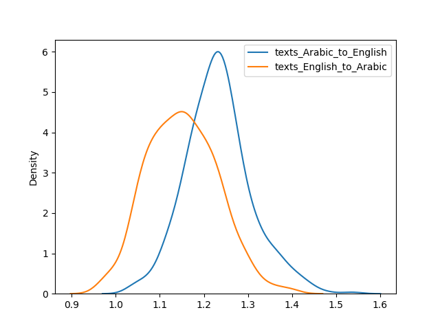

# ADHFAIS_MINOR: Arabic to English Ratio

In a nutshell, I used ChatGPT to generate 500 essays of 2,000-2,500 words. Each essay was on the intersection of two topics, randomly selected from a list of some 35 topics (listed below). ChatGPT generated 500 essays in English and then translated them into Arabic, and then the other way around. Since sometimes ChatGPT messes up requests, an additional test was applied to check if translations have the same number of paragraphs; if not, re results were discarded. Finally, exploratory statistics were generated for two sets of translations.  The distribution of ratios in both cases was fairly consistent: mean and median values are very close to each other; and standard deviation is low. However, interestingly, we get different ratios depending on the direction of translation: 1.23 in the case of Arabic to English, and 1.15 in the case of English to Arabic. In other words, Arabic is 23% longer than English, if Arabic is translated into English; and Arabic is only 15% longer, if English translated into Arabic. I am not entirely sure what the reasons are for this, but we can use these margins for our corpus estimates. You can find both the Python code and generated texts in ``

```python
themes = ["politics", "economy", "culture", "traveling", "history", "sports",
		  "weather", "engineering", "science", "humanities", "literature",
		  "music", "climate", "technology", "oceans", "forests", "animals",
		  "urban life", "rural life", "spirituality", "religion", "ethics",
		  "philosophy", "programming", "art", "finances", "mortgage",
		  "pets", "archeology", "democracy", "tyranny", "fascism",
		  "autocracy", "capitalism", "socialism", "slavery", "repressions"]
```

```
### texts_Arabic_to_English

Count: 506
Mean: 1.23
Median: 1.23
Standard Deviation: 0.07
Minimum: 1.034
25th Percentile (Q1): 1.184
75th Percentile (Q3): 1.272
Maximum: 1.5362

### texts_English_to_Arabic

Count: 505
Mean: 1.15
Median: 1.149
Standard Deviation: 0.08
Minimum: 0.966
25th Percentile (Q1): 1.0915
75th Percentile (Q3): 1.20658
Maximum: 1.4009
```



